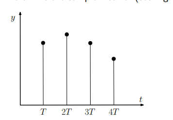
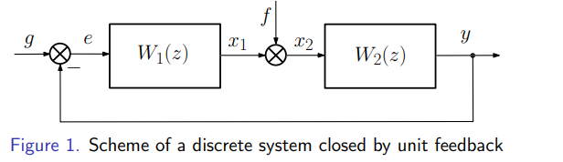

DCS lab2
--------------------------------------------------------------

lecture 范围3~9

Forms of the linear discrete models
--------------------------------------------------------------

#### Normal Cauchy form

The difference equation "input-state-output" (state space)

$$
\left.\left\{\begin{array}{l}x(m+1)=Ax(m)+Bu(m),\\y(m)=Cx(m),\end{array}\right.\right.
$$

where $x\in R^n$ is a state vector, $u\in R^k$ is a control signal,
 $y\in R^k$ is a vector of controlled (output) variables,
 $A-n\times n$ is a matrix of constant coefficients that determines the dynamic properties of
 a system,
 $B-n\times k$ is a matrix of inputs, $C-k\times n$ is an output matrix.

#### Difference equations system:

$$
x(0),u(0),m=0,\\
x(1)=Ax(0)+Bu(0),\\
x(1),u(1),m=1,\\
x(2)=Ax(1)+Bu(1)=A^2x(0)+ABu(0)+Bu(1),\\
x(m)=Ax(m-1)+Bu(m-1)= \\ 
A^m(x(0))+A^{m-1}Bu(0)+\\
+A^{m-2}Bu(1)+\ldots+Bu(m-1)=A^mx(0)+\sum_{i=0}^{m-1}A^iBu(m-1-i),
$$

An equivalent form: 

$$
x(m)=A^mx(0)+\sum_{i=0}^{m-1}A^{m-1-i}Bu(i).
$$

对比连续形式：

$$
\begin{array}{l}\dot{x}=Ax+Bu\\x(t)=e^{At}x(0)+\int_0^te^{A(t-\tau)}Bu(\tau)d\tau=e^{At}x(0)+\int_0^te^{A\tau}Bu(t-\tau)d\tau.\end{array}
$$

#### n阶差分方程求解（与连续的类似，先求特解，再求通解）：

$$
\begin{array}{l}y(m+n)+a_{n-1}y(m+n-1)+\ldots+a_1y(m+1)+a_0y(m)=\\=b_ku(m+k)+b_{k-1}u(m+k-1)+\ldots+b_1u(m+1)+b_0u(m),\end{array}
$$

where y is the controlled (output) variable, $u$ is the input signal, $m$ is the sample time number,
 $m=0,1,2\ldots,n$ is the maximum shift of the output variable that determines the orden
 of the difference equation,
 k is the maximum shift of the input variable,
 $k\leq n$ is a condition of physical feasibility and the parameters:

$$
\begin{array}{l}a_i,i=0,1,\ldots,n-1,\\b_j,j=\overline{0,k}.\end{array}
$$

are the constant coefficients calculated from the parameters of the system (object).

$$
z^n+\alpha_{n-1}z^{n-1}+\ldots+\alpha_1z+\alpha_0=0.
$$
（求特解）

Assume that the external (input) signal is constant $u( m) = u_0= $const, for all $m=0,1,2,\ldots$
 A particular solution $y_r(m)$ as well as constant function $y_r(m)=y_0$. Then:

$$
\begin{aligned}
&y_r(m+i)=y_0, \\
&i=\overline{0,n}, \\
&\sum_{i=0}^na_iy(m+i)=\sum_{j=0}^kb_ju(m+j),
\end{aligned}
$$

and the constant particular solution that turns the original equation into identity is given by:

$$
y_0=\frac{\sum_{j=0}^kb_j}{\sum_{i=0}^na_i}u_0.
$$
（求通解）特征根不同得唯一解

At the next step, let's seek a solution to the original difference equation in the following form:

$$
y(m)=\sum_{i=1}^nc_iz_i^m+y_r(m),
$$
where z¡ are the roots of the characteristic polynomial with different values, $c_{i}$ are unknown coefficients that depend on the initial conditions.
To calculate the unknown coefficients using $n$ given initial conditions:
 $y(0),y(1),\ldots,y(n-1)$ compose a system of $n$ equations:

$$
\left.\left\{\begin{array}{l}\sum_{i=1}^nc_i+y_r(0)=y(0),\\\sum_{i=1}^nc_iz_i+y_r(1)=y(1),\\\cdots\cdots\cdots\cdots\cdots\\\sum_{i=1}^nc_iz_i^{n-1}+y_r(n-1)=y(n-1),\end{array}\right.\right.
$$

The resulting system of $n$ equations is uniquely solved with respect to $n$ unknown coefficients $c_{j}$ if all the roots $z_i$ are different.

## Discrete Laplace Transform

> [傅里叶变换、拉普拉斯变换、Z 变换的联系是什么？为什么要进行这些变换？ - 知乎 (zhihu.com)](https://www.zhihu.com/question/22085329#!)

> [《信号与系统》z变换总结 - 知乎 (zhihu.com)](https://zhuanlan.zhihu.com/p/447345530)

> [拉普拉斯变换和Z变换之间的关系 - 知乎 (zhihu.com)](https://zhuanlan.zhihu.com/p/487846090)

#### Lattice Function

#### Discrete Laplace Transform

将Lattice 函数转化为 laplace 域

$$
Y(z)=\sum_{m=0}^\infty y(m)z^{-m},
z=e^{sT}。
$$
特殊情况

$$
\begin{aligned}Y(z)&=Z[y(m)]=\sum_{m=0}^\infty y_0z^{-m}=y_0\sum_{m=0}^\infty z^{-m}=\\\\&=y_0\left(1+z^{-1}+z^{-2}+\ldots\right)=y_0\left(\frac1{1-z^{-1}}\right)=\frac{y_0z}{z-1}.\end{aligned}
$$
逆变换

$$
y(m)=\frac1{2\pi j}\oint Y(z)z^{m-1}dz.
$$

###### 计算圆积分的方法，留数定理

###### 分子分母化简方法

将连续Laplace 到 离散Laplace的直接转化

$$
Y(z)=Z[y(m)]=\frac1{2\pi j}\oint\frac{Y(s)}{1-e^{sT}\cdot z^{-1}}ds,
$$

#### Transfer Function of the Discrete Systems

同连续

$$
\begin{gathered}
\left(\sum_{i=0}^na_iz^i\right)Y(z)=\left(\sum_{j=0}^kb_jz^j\right)G(z), \\
W(z)=\frac{Y(z)}{G(z)}=\frac{\sum_{j=0}^kb_jz^j}{\sum_{i=0}^na_iz^i}, 
\end{gathered}
$$

$$
\left.\left\{\begin{array}{l}x(m+1)=Fx(m)+Bg(m),\\y(m)=Cx(m).\end{array}\right.\right.
$$

$$
\begin{aligned}
&(zI-F)X(z)=BG(z), \\
&X(z)=(zI-F)^{-1}BG(z). \\
&Y(z)=C(zI-F)^{-1}BG(z).\\
&W(z)=C(zI-F)^{-1}B.
\end{aligned}
$$

$$
Y(z)=\left(I+W_{ol}(z)\right)^{-1}W_{ol}(z)G(z)+\left(I+W_{ol}(z)\right)^{-1}W_2(z)F(z).
$$

## Discrete System Stability Types 

#### Asymptotic stability渐进稳定，对速度没要求

#### Exponential stability对速度有要求

### 离散系统稳定性分析方法，Lyapunov method.

定义一个Lyapunov函数，（三性质）

#### 稳定定理：

差分小于0

#### 用Lyapunov 方程研究稳定性

#### 稳定性判据：特征根位于单位圆内。

## 参考模型方法求 LSFB matrix

能控能观，求Sylvester矩阵

#### 连续型参考模型转化为离散型参考模型

## LAB2(variant 23)

#### 参控模型，极点放置方法

#### Disturbance mathematical model

$$
\xi(k+1)=\Gamma_d\xi(k),\\
g(k)=H\xi(k), \\
g(k)=A+BkT+C(kT)^2, \\
\xi_{1}(k)=g(k), \\
g(k+1)=A+BkT+BT+C(kT)^{2}+2CkT^{2}+CT^{2},  \\
\xi_{2}(k)=g(k+1)=g(k)+BT+2CkT^{2}+CT^{2}, \\
g(k+2)=g(k+1)+BT+2CkT^{2}+2CT^{2}+CT^{2}, \\
BT+2CkT^{2}+CT^{2}=g(k+1)-g(k), \\
\xi_{3}(k)=2g(k+1)-g(k)+CT^{2}, \\
g(k+3)=2g(k+2)-g(k+1)+CT^{2}, \\
CT^{2}=g(k+1)-g(k), \\
\xi_{4}(k)=3g(k+2)-3g(k+1)+g(k).
$$

And than
$$
\left.\left\{\begin{array}{l}\xi_1(k+1)=\xi_2(k),\\\xi_2(k+1)=\xi_3(k),\\\xi_3(k+1)=\xi_1(k)-3\xi_2(k)+3\xi_3(k),\\g(k)=\xi_1(k).\end{array}\right.\right.
$$

$$
\left.\xi(0)=\left[\begin{array}{c}A\\A+BT+CT^2\\A+2BT+3CT^2\end{array}\right.\right], 
$$

$$
\begin{gathered}
\left.\left[\begin{array}{c}{\xi_{1}(k+1)}\\{\xi_{2}(k+1)}\\{\xi_{3}(k+1)}\end{array}\right.\right]=\left[\begin{array}{ccc}{0}&{1}&{0}\\{0}&{0}&{1}\\{1}&{-3}&{3}\end{array}\right]\left[\begin{array}{c}\xi_{1}(k)\\\xi_{2}(k)\\\xi_{3}(k)\end{array}\right], \\
\left.g(k)=\left[\begin{array}{ccc}{1}&{0}&{0}\end{array}\right.\right]\left[\begin{array}{c}{\xi_{1}(k)}\\{\xi_{2}(k)}\\{\xi_{3}(k)}\end{array}\right], \\
\left.\Gamma_{d}=\left[\begin{array}{ccc}{0}&{1}&{0}\\{0}&{0}&{1}\\{1}&{-3}&{3}\end{array}\right.\right], \\
\left.H=\left[\begin{array}{ccc}{1}&{0}&{0}\end{array}\right.\right]. 
\end{gathered}
$$

#### 1. Design a command generator mathematical model for the signal g(k) = A sin(kT ω) using parameters listed in Table 1.

$$
g(k)=A\sin(kT\omega)=1.52*sin(k*0.25*0.55)
$$

#### 2. Design an “input-state-output” discrete disturbance mathematical model using parameters listed in Table 2.

$$
0.8+4.5kT+0.15(kT)^{2}
$$

 
